# UNIX/Linux operating systems (Basic) by Almaveno.

Установка и обновления системы Linux. Основы администрирования.

## Contents

## Part 1. Установка ОС

* Скачиваем образ **Ubuntu 20.04 server LTS** 
* Ставим образ на **VirtualBox**
* Результат выполненого запроса `cat /etc/issue` внутри получившейся виртуальной машины
    *Версия Ubuntu* 

 

## Part 2. Создание пользователя

* Выполняем команды `sudo adduser new_user` для создания нового юзера
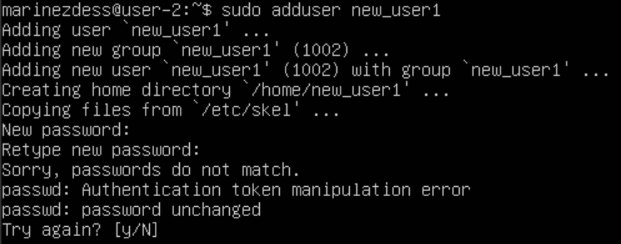 *Создание нового юзера* 
* Выполняем команды `sudo usermod -aG adm new_user` для добавления его в группу `adm`
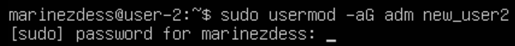 *Добавление юзера в группу* 
* Для проверки успеха выполнения задания выполняем `vim /etc/group`, что позволит посмотреть появился ли новый пользователь в группе `adm`  
 *Группа adm* 
* Новый пользователь должен быть в выводе команды `cat /etc/passwd`
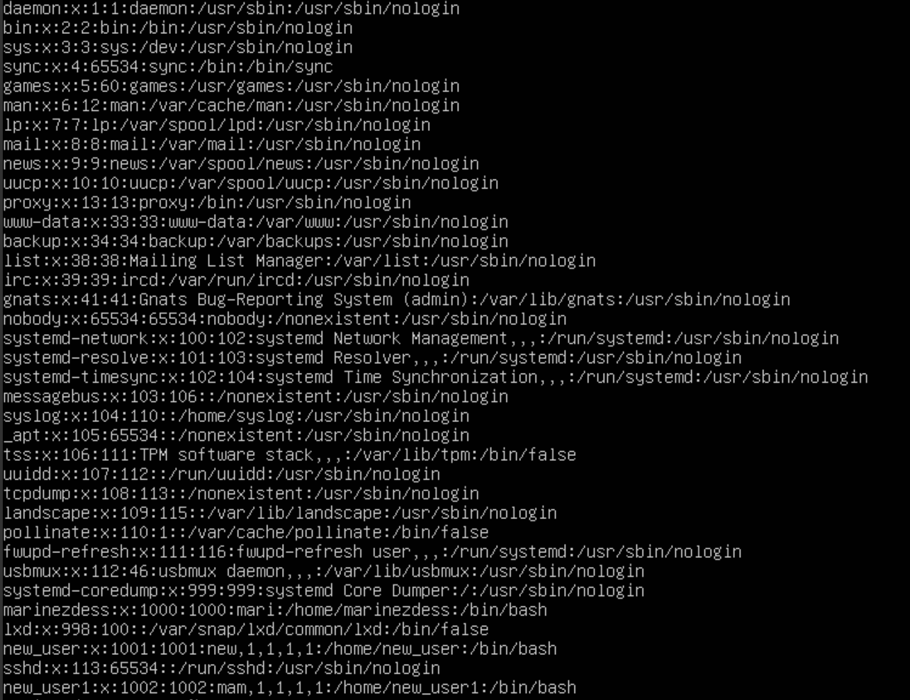 *passwd* 

 

## Part 3. Настройка сети ОС

* Выполняем команду `sudo hostnamectl set-hostname user-1`

* Далее `cat /etc/hostname` - проверка результата

 *Результат смены имени машины* 

 

**== Задание 2 ==**

##### Установливаем временную зону в текущем времени.

* Выполняем команду `sudo timedatectl set-timezone Europe/Moscow`

* Проверяем результат, выполнив `timedatectl`

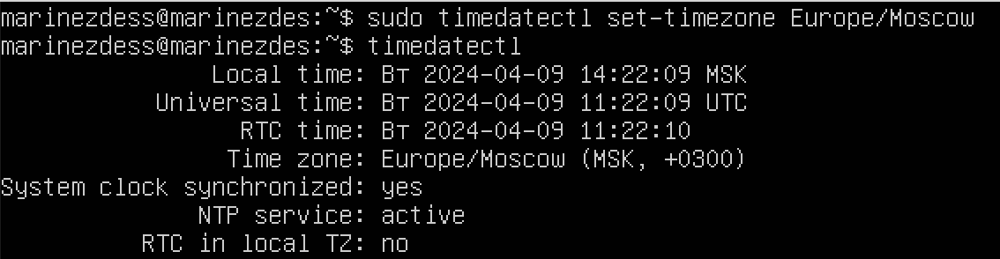 *Результат установки системного времени* 

 

**== Задание 3 ==**

##### Выведем названия сетевых интерфейсов с помощью консольной команды.
* **lo (loopback device)** – виртуальный интерфейс, присутствующий по умолчанию в любом Linux. Посмотреть привязку можно в файле /etc/hosts.

* Выполняем команду `ls /sys/class/net` для отображения сетевых интерфейсов

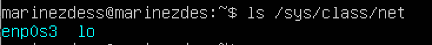 *Результат выполнения команды* 

 

**== Задание 4 ==**

##### Получаем ip адрес устройства от DHCP сервера. 

* **DHCP** — протокол прикладного уровня модели TCP/IP, служит для назначения IP-адреса клиенту. Это следует из его названия — Dynamic Host Configuration Protocol. 

* Выполняем команду `ip r` для получения ip-адреса от DHCP сервера

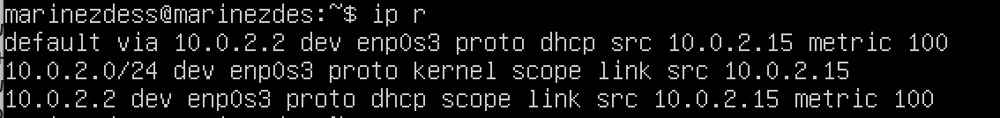 *Результат выполнения команды* 

 

**== Задание 5 ==**

##### В этом пункте oпределяем и выводим на экран внешний ip-адрес шлюза (ip) и внутренний IP-адрес шлюза, он же ip-адрес по умолчанию (gw). 

* Выполняем команду `wget -qO- eth0.me` для вывода внешнего ip шлюза, и `ip route | grep default` для вывода внутреннего

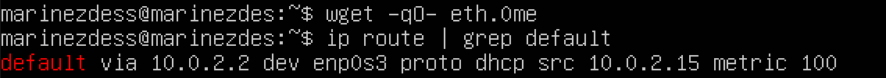 *Внешний ip-адрес шлюза (ip) и внутренний IP-адрес шлюза* 

 

**== Задание 6 ==**

##### Задаем статичные настройки ip, gw, dns.  

* Меняем доступ к файлу для дальнейшего его редактирования `sudo chmod 777 /etc/netplan/00-installer-config.yaml`

* Редактируем файл под нужные настройки используя `vim /etc/netplan/00-installer-config.yaml` 

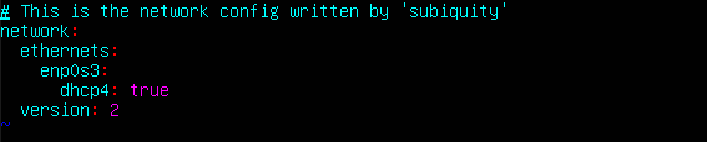 *Итоговые параметры в файле* 

* Сохраняем изменения командой `sudo netplan apply`

 

**== Задание 7 ==**

* Перезапускаем машину командой `reboot`
* Пингуем командой `hostname -I && ping -c 4 1.1.1.1 | grep "stat\|loss" && ping -c 4 ya.ru`

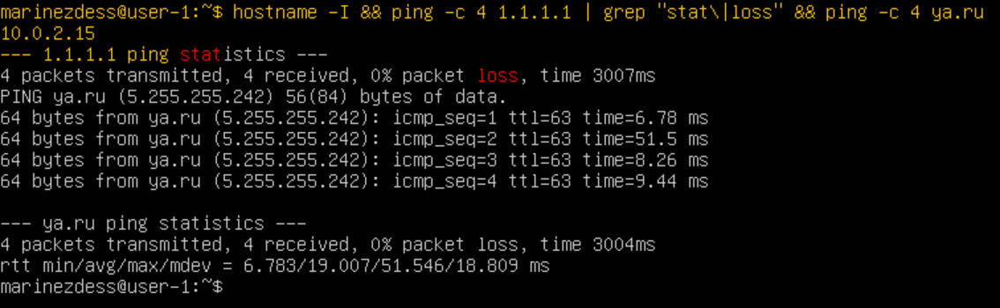 *Вывод команды* 

 

## Part 4. Обновление ОС

##### Обновляем системные пакеты до последней на момент выполнения задания версии.  

* Выполняем команду `sudo apt update` для получения доступных пакетов

* Обновляем системные пакеты до последней версии командой `sudo apt full-upgrade`

* Запускаем команду обновления ещё раз

 *Результат повторного запуска обновления* 

 

## Part 5. Использование команды **sudo**

##### Разрешаем созданному пользователю, созданному в [Part 2](#part-2-создание-пользователя), выполнять команду sudo.

* Sudo (su «do») позволяет системному администратору делегировать полномочия, чтобы дать определенным пользователям  возможность запускать некоторые (или все) команды от имени пользователя root или другого пользователя, обеспечивая контрольный журнал команд и их аргументов.

* Командой `sudo usermod -a -G sudo new_user` разрешаем пользователю использовать sudo

* Командой `su - new_user` меняем пользователя

* Меняем hostname под другим пользователем `sudo hostnamectl set-hostname user-2` 

* `cat /etc/hostname` смотрим результат

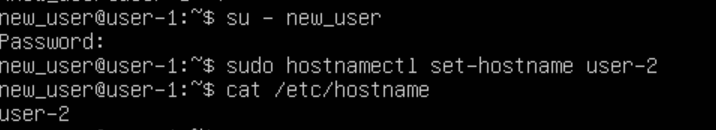 *Результат выполнения команд* 

 

## Part 6. Установка и настройка службы времени

##### Настроиваем службу автоматической синхронизации времени.  

* Проверяем время которое установлено в данный момент командой `date`

 *Установленое сейчас время* 

* Установка NTP командой `sudo apt install systemd-timesyncd`

* Активируем NTP командой `sudo timedatectl set-ntp on`

* Вывод команды `timedatectl show`

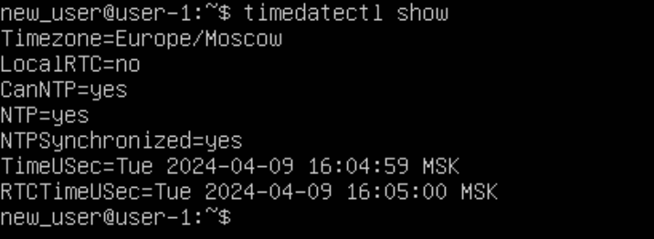 *Результат работы команды* 

 

## Part 7. Установка и использование текстовых редакторов 

##### Установавливаем текстовые редакторы **VIM**, **NANO**, **mcedit**.  

* Используя команду `sudo apt install mcedit` устанавливаем текстовый редактор mcedit

 

##### Создаем файл *test_X.txt*.

**VIM** 

* Создаем файл с помощью команды `vim test_vim.txt`

* Нажимаем "i" для перехода в режим редактирования

* Пишем ник: "almaveno"

Для выхода с сохранением нажимем `Esc` вводим команду `:wq` и нажимаем `Enter`

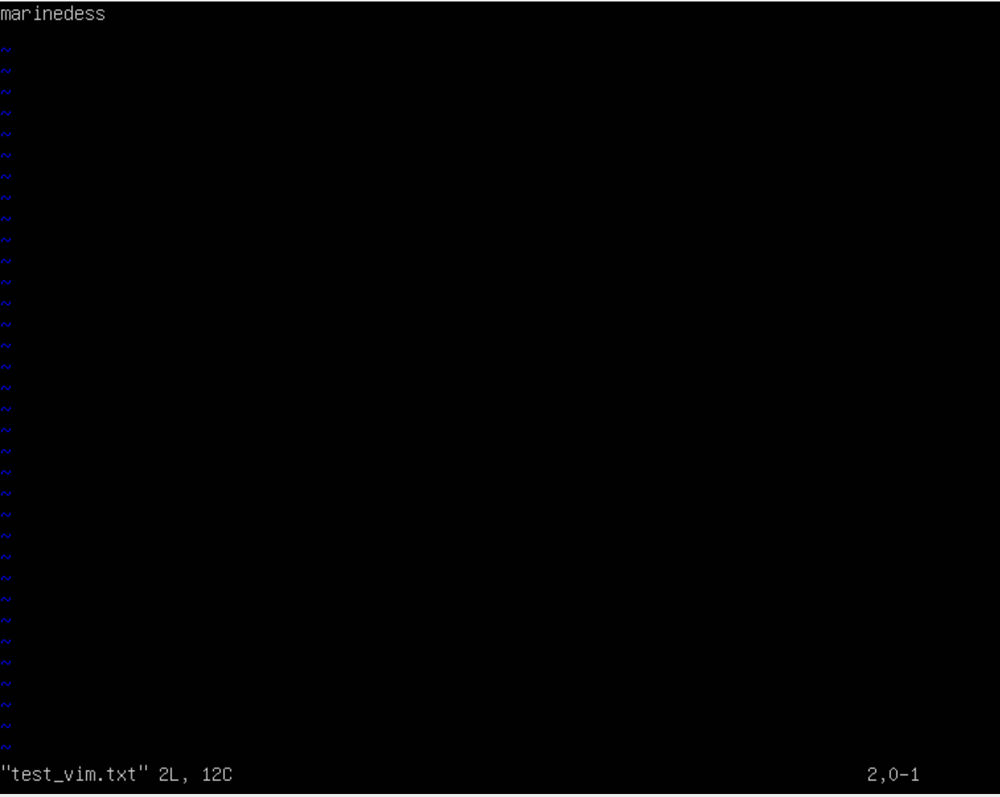 *VIM* 

 

**NANO**

* Создаем файл с помощью команды `nano test_nano.txt`

* Пишем ник: "almaveno"

* Для выхода нажимаем комбинацию `ctrl+x` для сохранения вводим `Y` и нажимаем`Enter`

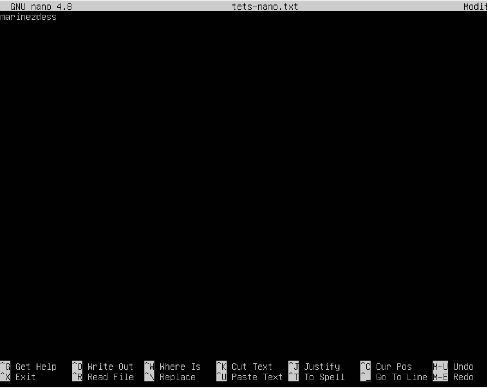 *NANO* 

 

**MCEDIT**

* Cоздаем файл с помощью команды `mcedit test_mcedit.txt`

* Пишем ник: "almaveno"

* Для выхода с сохранением нажимаем `Esc`, а затем клавишу `YES`

 *mcedit* 

**== Задание 3 ==**

##### Открываем файл на редактирование и заменяем никнейм на строку "21 School 21".

**VIM**

* Открываем файл с помощью команды `vim test_vim.txt`

* Нажимаем "i" для перехода в режим редактирования

* Изменяем ник на "21 School 21"

* Для выхода без сохранения нажимаем `Esc` вводим команду `:q!` и нажимаем `Enter`

 *VIM* 

**NANO**

* Открываем файл с помощью команды `nano test_nano.txt`

* Изменяем ник на "21 School 21"

* Для выхода без сохранения нажимаем комбинацию `ctrl+x`, потом `N`

 *NANO* 

**MCEDIT**

* Открываем файл с помощью команды `mcedit test_mcedit.txt`.

* Изменяем ник на "21 School 21"

* Для выхода без сохранения нажимаем `Esc`, а затем `No`

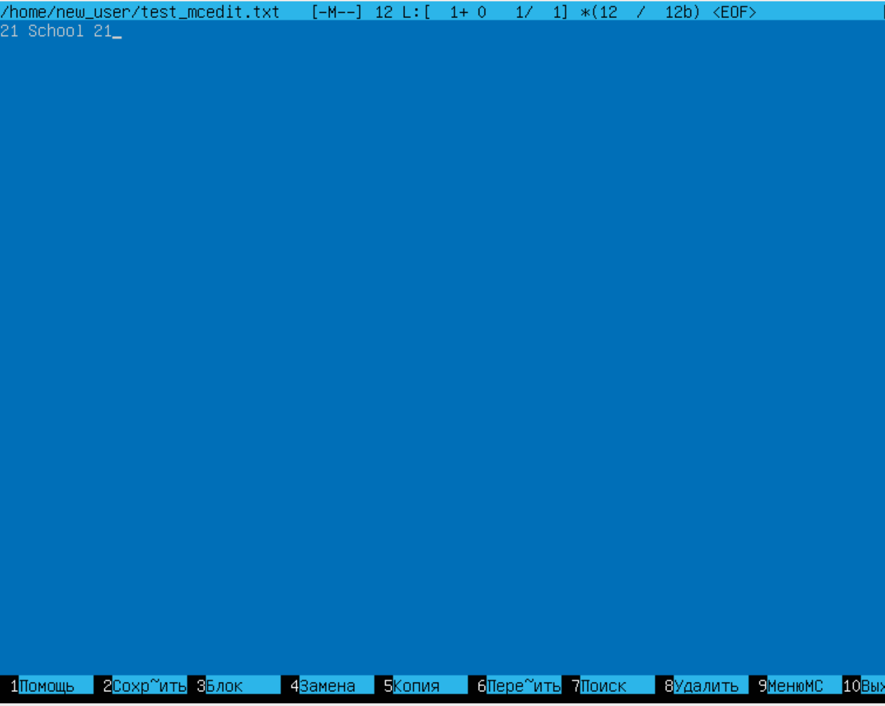 *mcedit* 

 

**== Задание 4 ==**

##### Используем функции поиска по содержимому файла и замены слов. 

**VIM**

* Открываем файл с помощью команды `vim test_vim.txt`

* Для поиска в VIM вводим `/marinezdes` и искомое слово выделяется в самом редакторе

 *VIM* 

* Для замены слова в VIM вводим `:%s/marinezdes/21 School 21` и слово "almaveno" заменяется на "21 School 21"

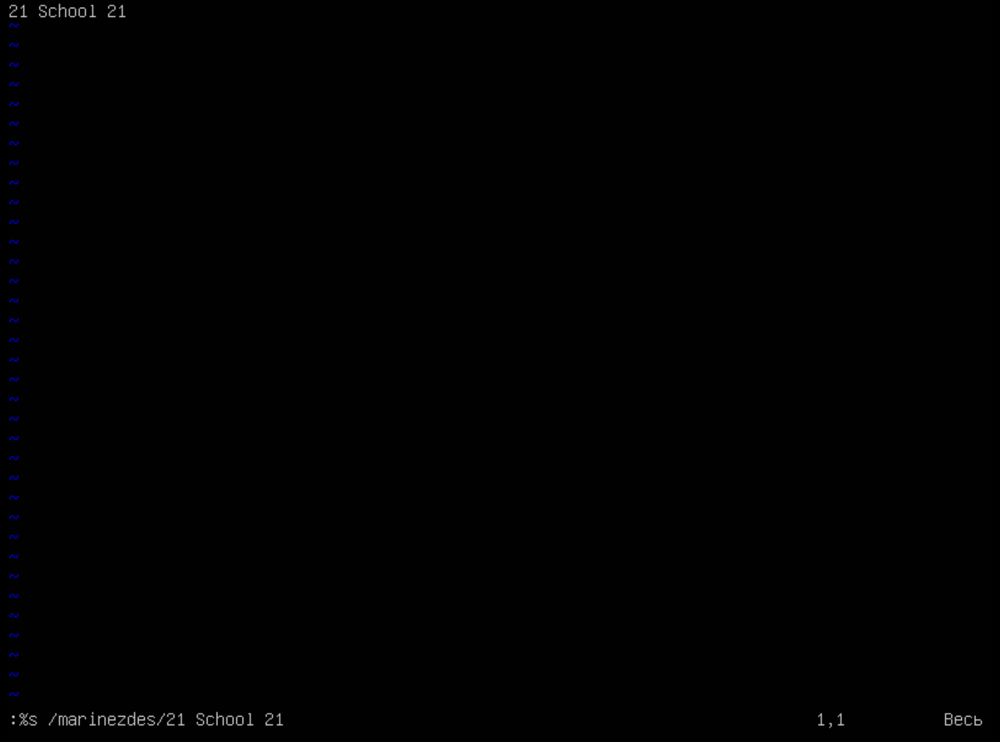 *VIM* 

 

**NANO**

* Открываем файл с помощью команды `nano test_nano.txt`

* Для поиска в NANO вводим `ctrl + W`

 *NANO* 

* Для замены слова в NANO вводим `ctrl + \`, пишем "almaveno", нажимаем `Enter`, пишем "21 School 21", нажимаем `Enter`, выбираем `Y`

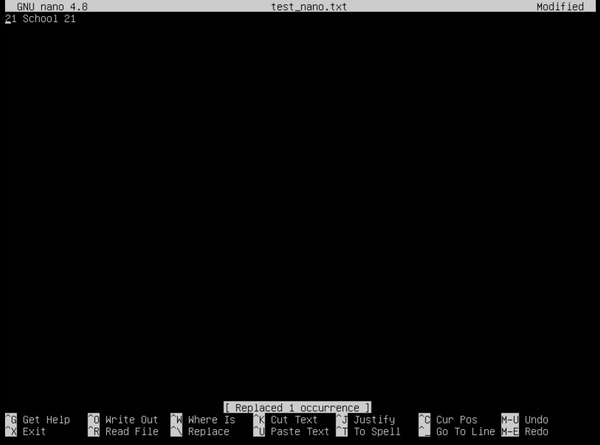 *NANO* 

 

**MCEDIT**

* Открываем файл с помощью команды `mcedit test_mcedit.txt`

* Для поиска в mcedit вводим `F7`, затем вводим слово, которое хотим найти, оно выделяется зеленым

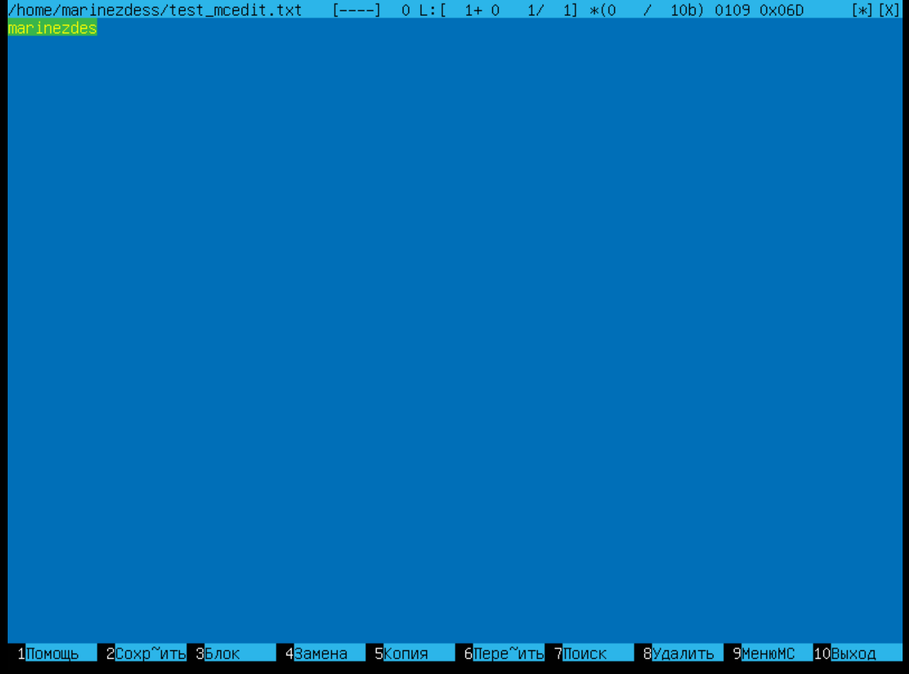 *mcedit* 

* Для замены слова в mcedit жмем `F4`, затем вводим "almaveno", нажимаем стрелку вниз, пишем "21 School 21"

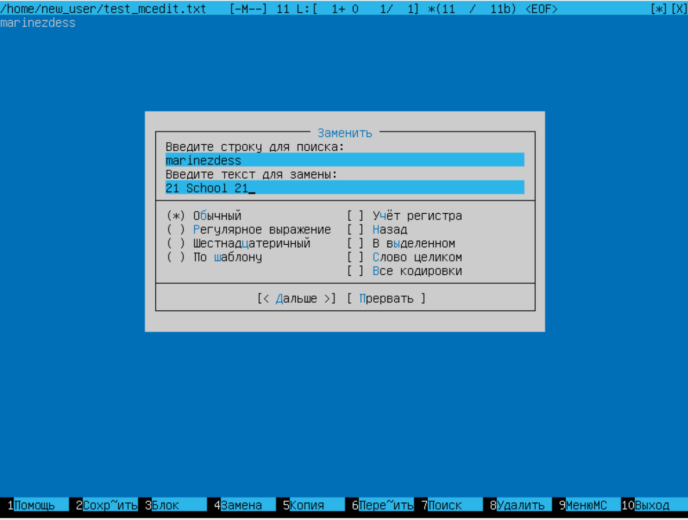 *mcedit* 

 

## Part 8. Установка и базовая настройка сервиса **SSHD**

* Устанавливаем службу SSHd командой `sudo apt install openssh-server`

* Проверяем наличие командой `ssh -V`

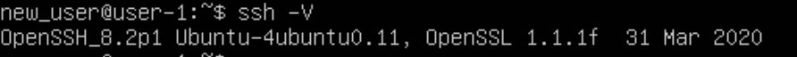 *Служба SSHd* 

* Добавляем автостарт службы SSHd командой `sudo update-rc.d ssh defaults`

* Открываем config `sudo vim /etc/ssh/sshd_config`

* Изменяем порт SSHd: добавляем строку `Port 2022`

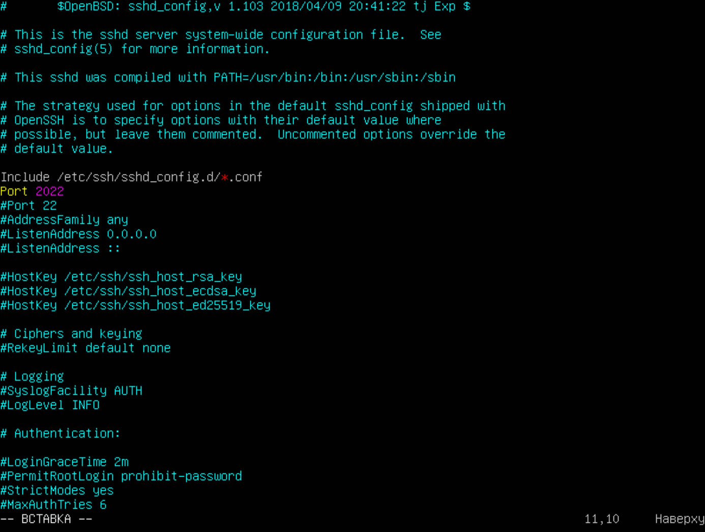 *Изменёный config* 

* Используем команду `/etc/init.d/ssh restart` для того что бы изменения вступили в силу

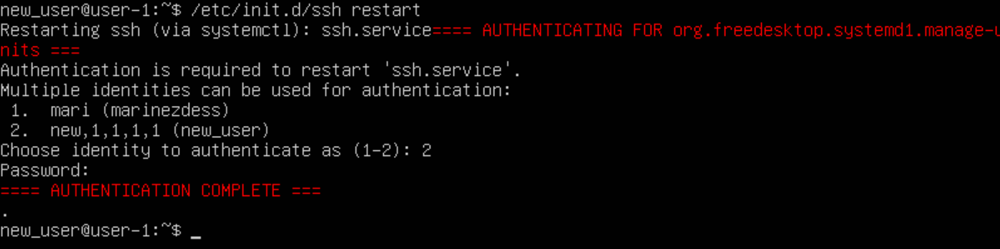 *Вывод команды* 

Используем команду `ps -axfv | grep sshd` для проверки наличия процесса

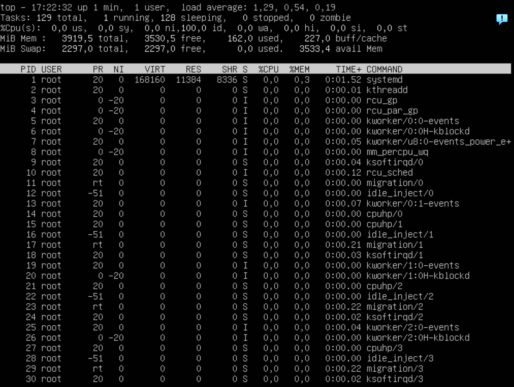 *SSHd процесс* 

* Команда `ps` показывает текущие процессы на сервере. 

* Команда `grep` позволяет выдилить нужную нам информацию по процессам

* флаг -a оставляет все процессы, кроме лидеров сеансов и процессов, не связанных с терминалом

* флаг -x заставляет `ps` отображать список всех процессов, которыми вы владеете

* флаг -f выводит полноформатный список

* флаг -v выводит информацию о версии

 

* Устанавливаем *net-tools* `sudo apt install net-tools`

* Выполняем команду `netstat -tan`

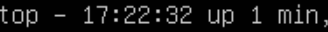 *Выполнение команды netstat -tan* 

* Опция -a показывает состояние всех сокетов

* -n показывает ip адрес, а не сетевое имя

* -t показывает только tcp соединения

* стобец Proto - протокол, используемый сокетом

* стобец Recv-Q - количество байтов, не скопированных пользовательской программой, подключенной к этому сокету

* стобец Local Adbress - локальный адрес (имя локального хоста) и номер порта сокета

* стобец Foreign Adbress - удаленный адрес (имя удаленного хоста) и номер порта сокета

* стобец State - состояние сокета

* 0.0.0.0 в выводе netstat означает, что ssh daemon прослушивает все интерфейсы IPv4, которые есть у машины

* Перезагружаем систему командой `sudo reboot`

 

## Part 9. Установка и использование утилит **top**, **htop**

* Командой `top` запускаем соответствующую утилиту

 *Запуск top* 

* uptime  
 

* количество авторизированных пользователей  
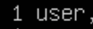 

* общая загрузка системы  
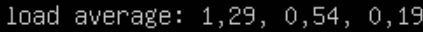 

* общее количество процессов  
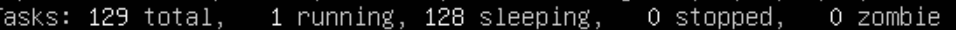 

* загрузка cpu  
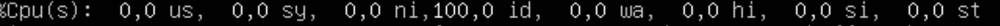 

* загрузка памяти  
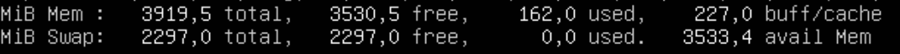 

* pid процесса, занимающего больше всего памяти  
 

* pid процесса, занимающего больше всего процессорного времени  
 

* Жмем `q` для выхода из top

 

*  командой `htop` запускаем утилиту

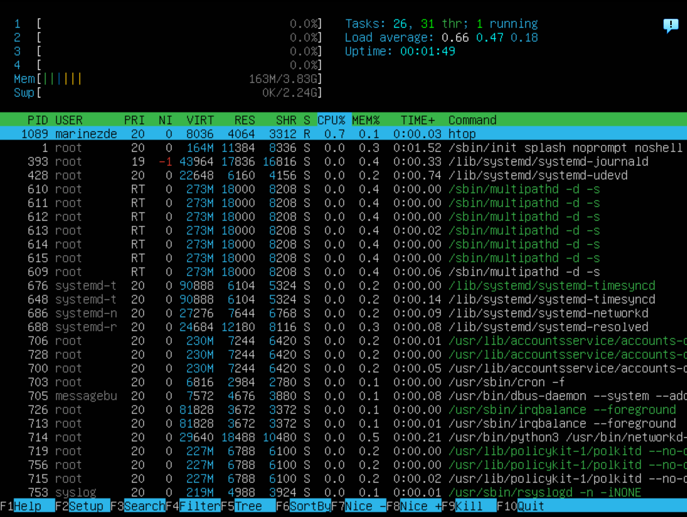 *Запуск htop* 

* Для выбора того как проводить сортировку мы нажимаем `F6`

* PID  
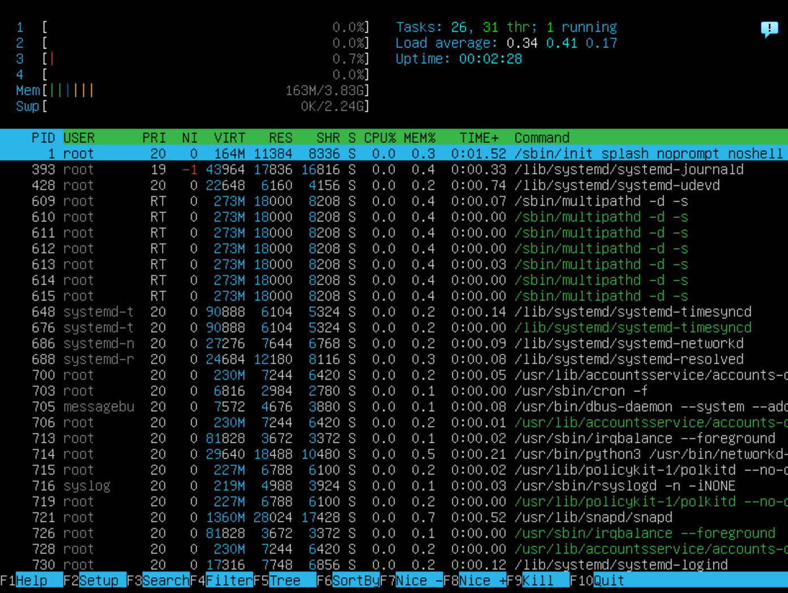 *PID* 

* PERCENT_CPU  
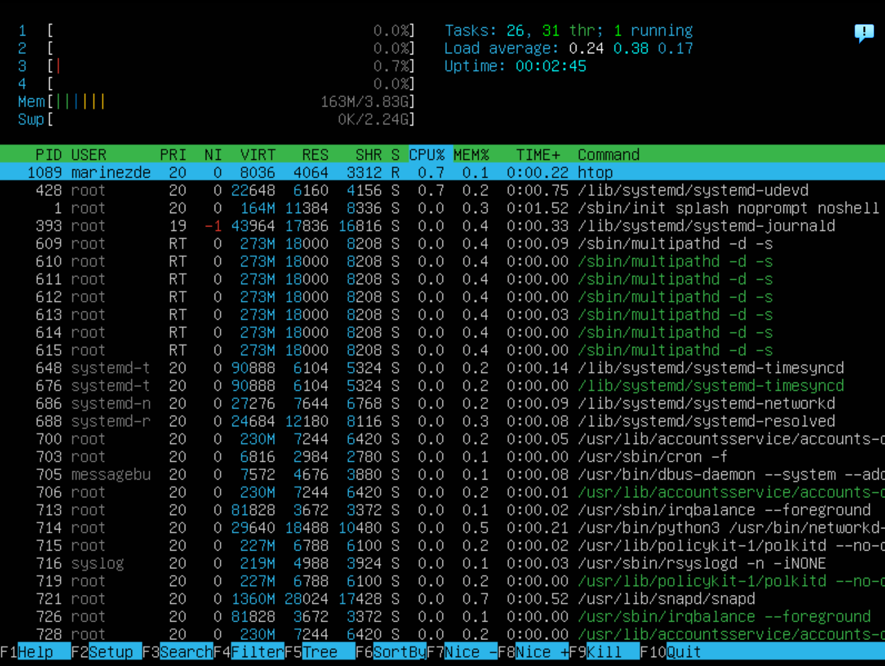 *PERCENT_CPU* 
 
* PERCENT_MEM  
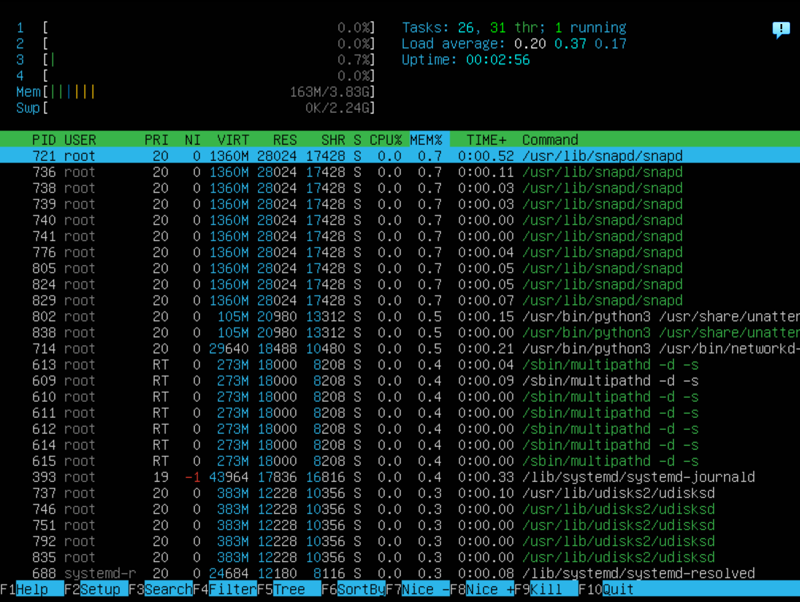 *PERCENT_MEM* 

* TIME  
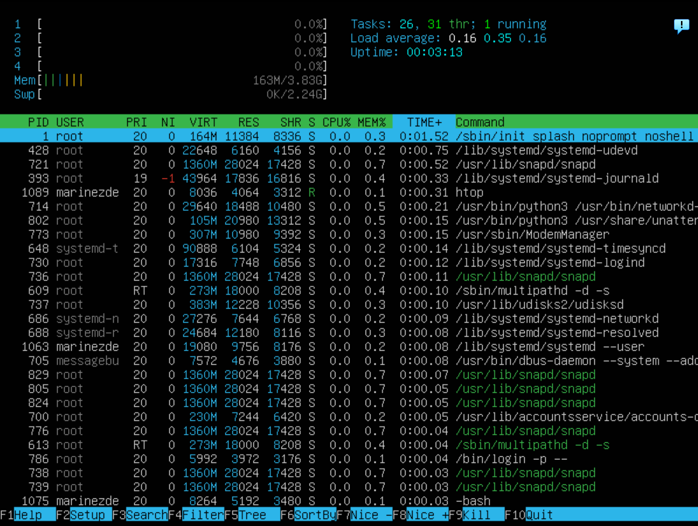 *TIME* 

* Для работы с фильтром нажимаем `F4`

* После мы вводим `SShd` и нажимаем `Enter`

* фильтр по SSHd  
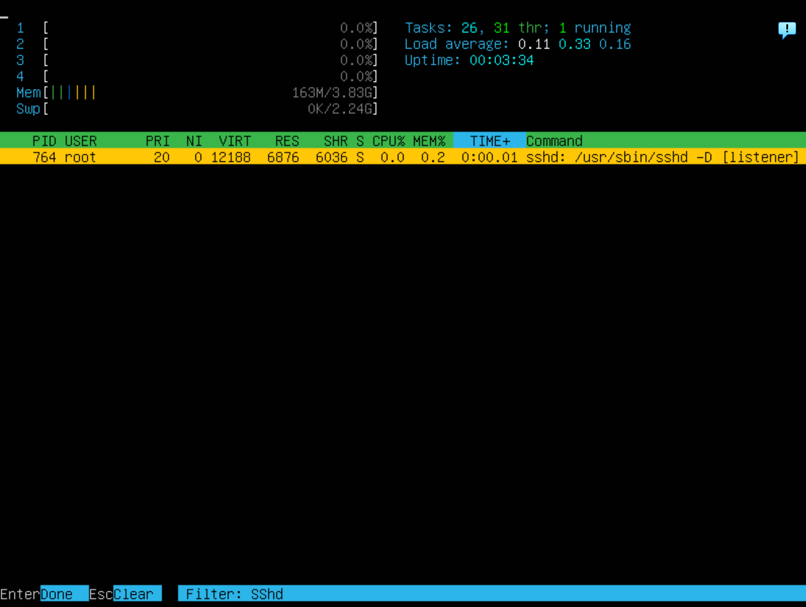 *SSHd* 

* Для работы с поиском нажимаем `F3`

* После мы вводим `syslog` и нажимаем `Enter`

* Результат поиска  
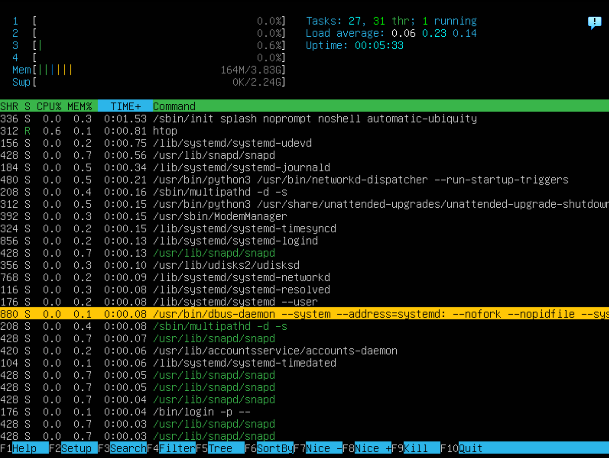 *Поиск syslog* 

* Выход `F10`

 

## Part 10. Использование утилиты **fdisk**

* Запуск утилиты командой `sudo fdisk -l`

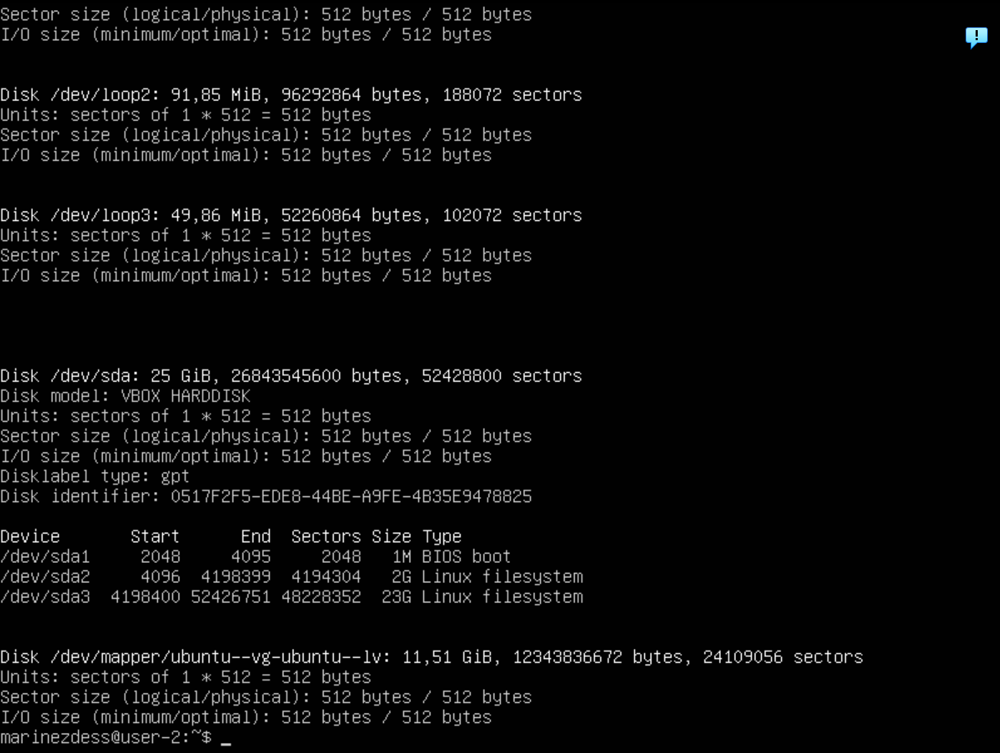 *Вывод команды* 

* Название жесткого диска VBOX HARDDISK   

* Размер  

* Количество секторов  

* Используем команду `free -h` для определения размера swap:  

 

## Part 11. Использование утилиты **df** 

**== Задание 1 ==**

* используем команду `df /`  
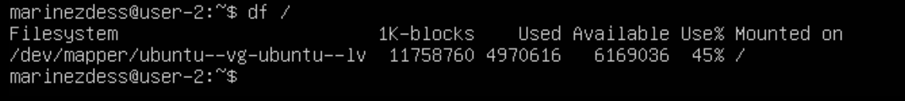 *Вывод команды* 
    
* Размер раздела  
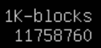

* Размер занятого пространства  
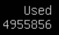

* Размер свободного пространства  
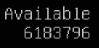

* Процент использования  
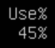

* Единица измерения в выводе: Кб

**== Задание 2 ==**

##### Запускаем команду df -Th.

* используем команду `df -Th /`  
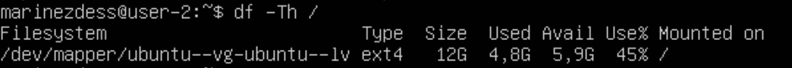 *Вывод команды* 

* Размер раздела  
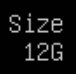

* Размер занятого пространства  
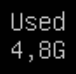

* Размер свободного пространства  
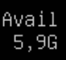

* Процент использования  
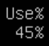

* Тип файловой системы для раздела  
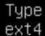

## Part 12. Использование утилиты **du**

* Запуcк команды `du`  
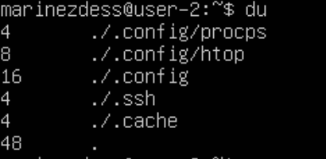 *Вывод команды* 

* С помощью команды `sudo du -s -h /home && sudo du -s -h /var && sudo du -s -h /var/log` выводим размер папок  
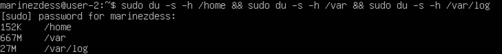 *Размер папок* 
    
* Вывести размер элементов `/var/log` с помощью команды `sudo du -sh /var/log*`  
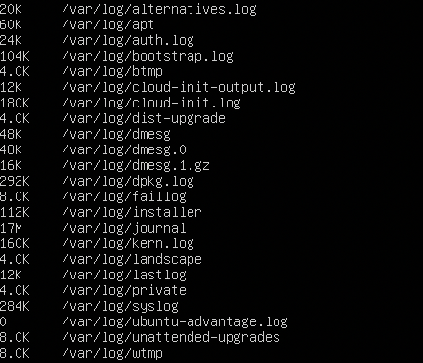 *Размер элементов* 

 

## Part 13. Установка и использование утилиты **ncdu**

* Командой `sudo apt install ncdu` устанавливаем ncdu

* Вывести размер папок с помощью команды `sudo ncdu` /home, /var, /var/log

 */home* 

 */var* 

 */var/log* 

 

## Part 14. Работа с системными журналами

* Просмотр `vim /var/log/dmesg`  


* Просмотр `vim /var/log/syslog`  


* Просмотр `vim /var/log/auth.log`  

    
* Для просмотра последней авторизации, имени пользователя и метода входа в систему используем команду `last`  
 *Результат работы команды* 

* Время авторизации Aug 17 19:18
* Имя пользователя almaveno
* Метод входа в систему tty1

* Командой `service sshd restart` перезапускаем службу SSHd

 *Результат работы команды* 

* Командой `sudo cat /var/log/syslog` выводим сообщение о рестарте служб
 *Результат работы команды* 

 

## Part 15. Использование планировщика заданий **CRON**

- Найти в системных журналах строчки (минимум две в заданном временном диапазоне) о выполнении.
- Вывести на экран список текущих заданий для CRON.
- Вставить в отчёт скрины со строчками о выполнении и списком текущих задач.

##### Удаляеем все задания из планировщика заданий.

* Используем команду `sudo apt install cron` для установки **CRON**

* Планируем задачу командой `crontab -e`

* В vim приписываем `"*/2 * * * * uptime"`

 *uptime* 

* Командой `sudo grep CRON /var/log/syslog` выводим системных задач

 *Системный журнал* 

* Командой `crontab -l` удаляем все запланированые задачи

* Проверяем список задач ещё раз

 *Системный журнал* 

 
