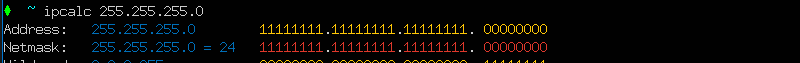
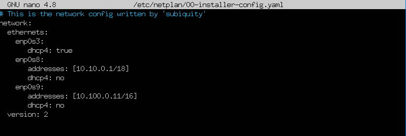
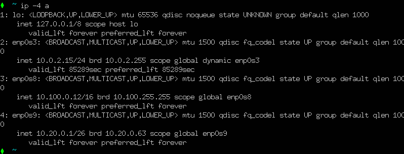
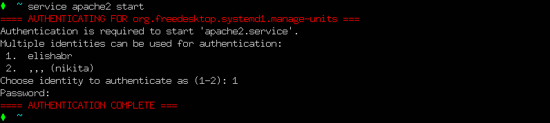

## Contents
1. [Part 1](#part-1-ipcalc-tool)
2. [Part 2](#part-2-static-routing-between-two-machines)
3. [Part 3](#part-3-iperf3-utility)
4. [Part 4](#part-4-network-firewall)
5. [Part 5](#part-5-static-network-routing)
6. [Part 6](#part-6-dynamic-ip-configuration-using-dhcp)
7. [Part 7](#part-7-nat)
8. [Part 8](#part-8-bonus-introduction-to-ssh-tunnels)


## Part 1. ipcalc tool

#### 1.1. Networks and Masks
- 1. Определить адрес сети 192.167.38.54/13  
  
    \> *Вывод команды `ipcalc` 192.167.38.54/13*
- 2. Определить перевод маски 255.255.255.0 в префиксную и двоичную запись, /15 в обычную и двоичную, 11111111.11111111.11111111.11110000 в обычную и префиксную  
  
    \> *перевод маски 255.255.255.0 в префиксную и двоичную запись*
  
    \> *перевод маски /15 в обычную и двоичную*  
    \> *У нас не получится использовать предыдущую команду, поскольку она не поддерживает ввод двоичных чисел. Поэтому можем вспомнить, что количество ненуливых битов в двоичной записи маски равно префексной записи маски 11111111.11111111.11111111.11110000 это /28 :*
  
    \> *11111111.11111111.11111111.11110000 в обычную и префиксную*
- 3. Определить минимальный и максимальный хост в сети 12.167.38.4 при масках: /8, 11111111.11111111.00000000.00000000, 255.255.254.0 и /4  
  
    \> *Определить минимальный и максимальный хост в сети 12.167.38.4 при маске: /8*
  
    \> *Определить минимальный и максимальный хост в сети 12.167.38.4 при маске: 11111111.11111111.00000000.00000000*
  
    \> *Определить минимальный и максимальный хост в сети 12.167.38.4 при маске: 255.255.254.0*
  
    \> *Определить минимальный и максимальный хост в сети 12.167.38.4 при маске: /4*
#### 1.2. localhost
- Определить, можно ли обратиться к приложению, работающему на `localhost`, со следующими IP: 194.34.23.100, 127.0.0.2, 127.1.0.1, 128.0.0.1  
`Localhost` имеет диапазон 127.0.0.1 — 127.255.255.254, поэтому можно обратиться к приложениям 127.0.0.2, 127.1.0.1.
#### 1.3. Network ranges and segments
- 1. Определить, какие из перечисленных IP можно использовать в качестве публичного, а какие только в качестве частных: 10.0.0.45, 134.43.0.2, 192.168.4.2, 172.20.250.4, 172.0.2.1, 192.172.0.1, 172.68.0.2, 172.16.255.255, 10.10.10.10, 192.169.168.1
- К частным IP адресам относятся диапазоны:
    - 10.0.0.0 — 10.255.255.255
    - 100.64.0.0 — 100.127.255.255
    - 172.16.0.0 — 172.31.255.255
    - 192.168.0.0 — 192.168.255.255
- Соответственно, публичные адреаса:
    - 134.43.0.2
    - 172.0.2.1
    - 192.172.0.1
    - 172.68.0.2
    - 192.169.168.1
- Частные:
    - 10.0.0.45
    - 192.168.4.2
    - 172.20.250.4
    - 172.16.255.255
    - 10.10.10.10
- 2. Опрелелить, какие из перечисленных IP адресов шлюза возможны у сети 10.10.0.0/18: 10.0.0.1, 10.10.0.2, 10.10.10.10, 10.10.100.1, 10.10.1.255
- Из перечисленных IP адресов шлюза возможны:
    - 10.0.0.1
    - 10.10.0.2
    - 10.10.10.10
    - 10.10.1.255  
\> *Минимальный адрес (сеть) и максимальный адрес (броадкаст) используются для других целей и не могут быть назначены устройствам в сети*  
\> *Возможны адреса от 10.10.0.1 до 10.10.63.254*
## Part 2. Static routing between two machines
- С помощью команды ip a посмотреть существующие сетевые интерфейсы  
  
    \> *Для первой машины ws1*  
  
    \> *Для второй машины ws2*  
- Описать сетевой интерфейс, соответствующий внутренней сети, на обеих машинах и задать следующие адреса и маски: ws1 - 192.168.100.10, маска /16, ws2 - 172.24.116.8, маска /12.
  
    \> *файл etc/netplan/00-installer-config.yaml первой машины ws1*  
  
    \> *файл etc/netplan/00-installer-config.yaml второй машины ws2* 
- Выполним команды `netplan apply` и `ip a` для применения и демонстрации изменений:
  
    \> *вывод резудьтата команд `netplan apply` и `ip a` на первой машины ws1*  
  
    \> *вывод резудьтата команд `netplan apply` и `ip a` на второй машины ws2* 
#### 2.1. Adding a static route manually
- Добавить статический маршрут от одной машины до другой и обратно при помощи команды вида `ip r add IP-ws1 via IP-ws2 dev интерфейс`
- Пропинговать соединение между машинами  
  
    \> *`ping 192.168.100.10`*  
  
    \> *`ping 172.24.116.8`* 
#### 2.2. Adding a static route with saving
- Перезапустить машины
- Добавить статический маршрут от одной машины до другой с помощью файла `etc/netplan/00-installer-config.yaml`
  
    \> *`etc/netplan/00-installer-config` на первой машины ws1*  
  
    \> *`etc/netplan/00-installer-config` на первой машины ws2* 
- Пропинговать соединение между машинами  
  
    \> *`ping 192.168.100.10`*  
  
    \> *`ping 172.24.116.8`* 
## Part 3. iperf3 utility
#### 3.1. Connection speed
- Перевести и записать в отчёт: 8 Mbps в MB/s, 100 MB/s в Kbps, 1 Gbps в Mbps
```
    8 Mbps = 1 MB/s
    100 MB/s = 800000 Kbps
    1 Gbps = 1000 Mbps
```
#### 3.2. iperf3 utility
- Измерить скорость соединения между ws1 и ws2
  
    \> *Вывод команды `ipref3 -s -f m` для первой машины*  
  
    \> *Вывод команды `ipref3 -c 192.168.100.10 -f m` для второй машины* 
## Part 4. Network firewall
#### 4.1. iptables utility
- Создать файл /etc/firewall.sh, имитирующий фаерволл, на ws1 и ws2:
- Нужно добавить в файл подряд следующие правила:
    - 1) на ws1 применить стратегию когда в начале пишется запрещающее правило, а в конце пишется разрешающее правило (это касается пунктов 4 и 5)
    - 2) на ws2 применить стратегию когда в начале пишется разрешающее правило, а в конце пишется запрещающее правило (это касается пунктов 4 и 5)
    - 3) открыть на машинах доступ для порта 22 (ssh) и порта 80 (http)
    - 4) запретить echo reply (машина не должна "пинговаться”, т.е. должна быть блокировка на OUTPUT)
    - 5) разрешить echo reply (машина должна "пинговаться")
```
    #!/bin/sh

    #/etc/firewall.sh для первой машины WS1 
    #Удаление всех правил в таблице "filter" (по-умолчанию).
    iptables –F
    iptables -X

    sudo iptables -A INPUT -p tcp --dport 22 -j ACCEPT
    sudo iptables -A INPUT -p tcp --dport 80 -j ACCEPT
    sudo iptables -A OUTPUT -p icmp --icmp-type echo-reply -j DROP
    sudo iptables -A OUTPUT -p icmp --icmp-type echo-reply -j ACCEPT
```
```
    #!/bin/sh

    #/etc/firewall.sh для второй машины WS2 
    #Удаление всех правил в таблице "filter" (по-умолчанию).
    iptables –F
    iptables -X

    sudo iptables -A INPUT -p tcp --dport 22 -j ACCEPT
    sudo iptables -A INPUT -p tcp --dport 80 -j ACCEPT
    sudo iptables -A OUTPUT -p icmp --icmp-type echo-reply -j ACCEPT
    sudo iptables -A OUTPUT -p icmp --icmp-type echo-reply -j DROP
```
-   
    \> *Вывод команды `iptables -L` для первой машины*  
-   
    \> *Вывод команды `iptables -L` для второй машины* 
- При построении правил в iptables важна очередность команд, выполняется всегда первое правило в очереди
#### 4.2. nmap utility
- Командой ping найти машину, которая не "пингуется", после чего утилитой nmap показать, что хост машины запущен
-   
    \> *`ping 192.168.100.10` WS2*  
-   
    \> *`ping 172.24.116.8` WS1* 
- Не пингуется ммашина WS1, найдем ее используя `nmap`
-   
    \> *`nmap 192.168.100.10` WS2*  
## Part 5. Static network routing
#### 5.1. Configuration of machine addresses
- Настроить конфигурации машин в etc/netplan/00-installer-config.yaml согласно сети на рисунке
  
-   
    \> *`etc/netplan/00-installer-config.yaml` WS22*  
-   
    \> *`etc/netplan/00-installer-config.yaml` WS21*  
-   
    \> *`etc/netplan/00-installer-config.yaml` WS11*  
-   
    \> *`etc/netplan/00-installer-config.yaml` r1*  
-   
    \> *`etc/netplan/00-installer-config.yaml` r2*  
- Перезапустить сервис сети. Если ошибок нет, то командой ip -4 a проверить, что адрес машины задан верно. Также пропинговать ws22 с ws21. Аналогично пропинговать r1 с ws11
-   
    \> *Вывод команды `ip -4 a` для машины ws22*  
-   
    \> *Вывод команды `ip -4 a` для машины ws21*  
-   
    \> *Вывод команды `ip -4 a` для машины ws11*  
-   
    \> *Вывод команды `ip -4 a` для машины r1*  
-   
    \> *Вывод команды `ip -4 a` для машины r2*  
-   
    \> *Вывод команды `ping 10.20.0.20` проверка связаности WS22 с WS21*  
-   
    \> *Вывод команды `ping 10.10.0.1` проверка связаности r1 с WS11* 
#### 5.2. Enabling IP forwarding.
- Для включения переадресации IP, выполните команду на роутерах: sysctl -w net.ipv4.ip_forward=1.
-   
    \> *Вывод команды `sysctl -w net.ipv4.ip_forward=1` для машины r1*  
-   
    \> *Вывод команды `sysctl -w net.ipv4.ip_forward=1` для машины r2*  
- Откройте файл /etc/sysctl.conf и добавьте в него следующую строку: `net.ipv4.ip_forward = 1`
-   
    \> *Добавление строки `net.ipv4.ip_forward = 1` в файл /etc/sysctl.conf на r1*  
-   
    \> *Добавление строки `net.ipv4.ip_forward = 1` в файл /etc/sysctl.conf на r2*  
#### 5.3. Default route configuration
- Настроить маршрут по-умолчанию (шлюз) для рабочих станций. Для этого добавить default перед IP роутера в файле конфигураций
-   
    \> *Добавление команды `routes: -to: default via: 10.20.0.1`  в файл `etc/netplan/00-installer-config.yaml ` для машины WS22*  
-   
    \> *Добавление команды `routes: -to: default via: 10.20.0.1`  в файл `etc/netplan/00-installer-config.yaml ` для машины WS21*  
-   
    \> *Добавление команды `routes: -to: default via: 10.10.0.1`  в файл `etc/netplan/00-installer-config.yaml ` для машины WS11*  
- Вызвать ip r и показать, что добавился маршрут в таблицу маршрутизации
-   
    \> *Проверка добавления маршрута `ip r` для машины WS22*  
-   
    \> *Проверка добавления маршрута `ip r` для машины WS21*  
-   
    \> *Проверка добавления маршрута `ip r` для машины WS11* 
- Пропинговать с ws11 роутер r2 и показать на r2, что пинг доходит. Для этого использовать команду: tcpdump -tn -i eth1 
-   
    \> *Вывод команды ping `10.100.0.10` для машины WS11*  
-   
    \> *Вывод команды `tcpdump -tn -i enp0s8` для машины r2* 
#### 5.4. Adding static routes
- Добавить в роутеры r1 и r2 статические маршруты в файле конфигураций
-   
    \> *Вывод команды `cat etc/netplan/00-installer-config.yaml` для машины r1*  
-   
    \> *Вывод команды `cat etc/netplan/00-installer-config.yaml` для машины r2*  
- Вызвать `ip r` и показать таблицы с маршрутами на обоих роутерах
-   
    \> *Вывод команды `ip r` для машины r1*  
-   
    \> *Вывод команды `ip r` для машины r2*  
- Запустить команды на ws11: `ip r list 10.10.0.0/[маска сети]` и `ip r list 0.0.0.0/0`
-   
    \> *Вывод команды `ip r list 10.10.0.0/18` и `ip r list 0.0.0.0/0` для машины ws11*  
- Вывод:  
    ```
    Маршрут по умолчанию имеет меньшую приоритетность. Поэтому для адреса 10.10.0.0/18
    был выбран маршрут, отличный от 0.0.0.0/0.
    ```
#### 5.5. Making a router list
- Запустить на r1 команду дампа: tcpdump -tnv -i eth0
-   
    \> *Вывод команды `tcpdump -tnv -i enp0s8` для машины r1*  
- При помощи утилиты traceroute построить список маршрутизаторов на пути от WS11 до WS21
-   
    \> *Вывод команды `traceroute 10.20.0.10` для машины WS11*  
- Вывод:  
    ```
    Для доставки пакета от исходного узла WS11 с ip-адресом 10.10.0.2 к конечному узлу WS21 с ip-адресом 10.20.0.10
    необходимо пройти несколько этапов. Сначала пакет направляется к шлюзу с ip-адресом 10.10.0.1.
    Затем пересылается на шлюз 10.100.0.12, который, в свою очередь, направляет его в целевую подсеть 10.20.0.0/26.
    Важно отметить, что каждый пакет, отправленный в сети, проходит через определенное количество узлов прежде
    чем достигнет своей конечной цели.

    Каждый пакет имеет свое время жизни. Это количество узлов, которые может пройти пакет перед тем,
    как он будет уничтожен. Этот параметр записывается в заголовке TTL, каждый маршрутизатор,
    через который будет проходить пакет уменьшает его на единицу. При TTL=0 пакет уничтожается,
    а отправителю отсылается сообщение Time Exceeded.

    Команда traceroute linux использует UDP пакеты. Она отправляет пакет с TTL=1 и смотрит адрес ответившего
    узла, дальше TTL=2, TTL=3 и так пока не достигнет цели. Каждый раз отправляется по три пакета
    и для каждого из них измеряется время прохождения. Пакет отправляется на случайный порт, который,
    скорее всего, не занят. Когда утилита traceroute получает сообщение от целевого узла о том, что порт
    недоступен трассировка считается завершенной.
    ```
#### 5.6. Using ICMP protocol in routing
- Запустить на r1 перехват сетевого трафика, проходящего через eth0 с помощью команды: `tcpdump -n -i eth0 icmp`
- Пропинговать с WS11 несуществующий IP (например, 10.30.0.111) с помощью команды: `ping -c 1 10.30.0.111`
-   
    \> *Вывод команды `ping -c 1 10.30.0.111` для машины WS11*  
-   
    \> *Вывод команды `tcpdump -n -i enp0s8 icmp` для машины r1*  
## Part 6. Dynamic IP configuration using DHCP
- Для r2 установить isc-dhcp-server и настроить в файле /etc/dhcp/dhcpd.conf конфигурацию службы DHCP:
- 1) Указать адрес маршрутизатора по-умолчанию, DNS-сервер и адрес внутренней сети
-   
    \> *Вывод команды `nano /etc/dhcp/dhcpd.conf` для машины r2*  
- 2) В файле resolv.conf прописать nameserver 8.8.8.8
-   
    \> *Вывод команды `nano /etc/resolv.conf` для машины r2*
- Перезагрузить службу DHCP командой `systemctl restart isc-dhcp-server`. Машину WS21 перезагрузить при помощи reboot и через ip a показать, что она получила адрес. Также пропинговать WS22 с WS21.
-   
    \> *Вывод команды `systemctl restart isc-dhcp-server` для машины r2*
-   
    \> *Вывод команды `ip a` для машины WS21*
-   
    \> *Вывод команды `ping 10.20.0.3`, пинг WS1 c машины WS22*  
- Указать MAC адрес у ws11, для этого в `etc/netplan/00-installer-config.yaml` надо добавить строки: `macaddress: 10:10:10:10:10:BA`, `dhcp4: true`
-   
    \> *Измененный файл `etc/netplan/00-installer-config.yaml` для машины WS11* 
- Для r1 настроить аналогично r2, но сделать выдачу адресов с жесткой привязкой к MAC-адресу (WS11). Провести аналогичные тесты
-   
    \> *Вывод команды `nano /etc/dhcp/dhcpd.conf` и команды `systemctl restart isc-dhcp-server` для машины r1* 
-   
    \> *Вывод команды ip a для машины w11*
- Запросить с WS21 обновление ip адреса 
-   
    \> *Запросить с WS21 обновление ip адреса командой `sudo dhclient enp0s8` и вывод команды `ip a` для машины WS21*
## Part 7. NAT
- Перед выполнением задания ознакомтись [use-iptables-NAT](https://interface31.ru/tech_it/2021/07/osnovy-iptables-dlya-nachinayushhih-chast-3-tablica-nat.html)
- В файле /etc/apache2/ports.conf на WS22 и r1 изменить строку Listen 80 на Listen 0.0.0.0:80, то есть сделать сервер Apache2 общедоступным
-   
    \> *Вывод измененного файла /etc/apache2/ports.conf для машины WS22*  
-   
    \> *Вывод измененного файла /etc/apache2/ports.conf для машины r1*  
- Запустить веб-сервер Apache командой `service apache2 start` на WS22 и r1
-   
    \> *Вывод команды service apache2 start для машины WS22*  
-   
    \> *Вывод команды service apache2 start для машины r1*  
- Добавить в фаервол, созданный по аналогии с фаерволом из Части 4, на r2 следующие правила:
    - 1) удаление правил в таблице "filter" - `iptables -F`
    - 2) удаление правил в таблице "NAT" - `iptables -F -t nat`
    - 3) отбрасывать все маршрутизируемые пакеты - `iptables --policy FORWARD DROP`
-   
    \> *Измененный фаил `/etc/firewall.sh` для машины r2 и заспустили его `sudo /etc/firewall.sh`*   
- Проверить соединение между WS22 и r1 командой `ping 10.100.0.11`
-   
    \> *Вывод команды `ping 10.100.0.11` для машины WS22*   
- Добавить в файл ещё одно правило:
    - 4) Разрешить маршрутизацию всех пакетов протокола ICMP
- Запускать файл также, как в Части 4
-   
    \> *Вывод команд для настройки и запуска фаервола для машины r2*  
-   
    \> *Вывод команды `ping 10.100.0.11` для машины WS22* 
- Добавить в файл ещё два правила:
    - 5) Включить SNAT, а именно маскирование всех локальных ip из локальной сети, находящейся за r2 (по обозначениям из Части 5 - сеть 10.20.0.0)  
    \> `iptables -t nat -A POSTROUTING -o enp0s8 -s 10.20.0.0/26 -j SNAT --to-source 10.100.0.12`  

    \> *Что делает SNAT? Он заменяет адрес источника пакета внешним адресом, также, при необходимости, меняет   и порт источника, что позволяет различать запросы, сделанные с одного и того же порта разных  ПК, запись о выполненной трансляции заносится в специальную таблицу трансляций (она же таблица NAT). Получив ответ роутер находит запись в таблице трансляций и на ее основании изменяет адрес и порт   назначения ответного пакета, после чего он прозрачно доставляется адресату в локальной сети.*

    - 6) Включить DNAT на 8080 порт машины r2 и добавить к веб-серверу Apache, запущенному на ws22, доступ извне сети (проброс портов)  
    \> `iptables -t nat -A PREROUTING -i enp0s8 -p tcp --dport 8080 -j DNAT --to-destination 10.20.0.20:80`  

    \> *Данное правило изменит адрес назначения всех пакетов пришедших на внешний интерфейс enp0s8 по протоколу tcp с портом назначения TCP-сегмента 8080 на адрес внутреннего сервера 10.20.0.20:80*

-   
    \> *Измененный фаил `/etc/firewall.sh` для машины r2 и заспустили его `sudo /etc/firewall.sh`. Команда `iptables -A FORWARD -m state --state ESTABLISHED -j ACCEPT` добавляет правило в цепочку FORWARD брандмауэра iptables, которое разрешает прохождение пакетов, связанных с уже установленными (established) сессиями.* 
- Проверить соединение по TCP для SNAT, для этого с WS22 подключиться к серверу Apache на r1 командой: `telnet 10.100.0.11 80`
-   
    \> *Вывод команды `telnet 10.100.0.11 80` на WS22* 
- Проверить подмену IP-адреса можно с помощью команды tcpdump - пингуем с машины ws22 роутер r1, в выводе tcpdump будет отображаться с какого адреса идет запрос - IP-адрес r2
-   
    \> *Вывод команды `sudo tcpdump -tn -i enp0s9 -p arp` на r1. Здесь происходит подмена IP адреса WS22 на r1* 
- Проверяем соединение по TCP для DNAT, для этого с r1 подключаемся к серверу Apache на ws22 (обращаться по адресу r2 и порту 8080)  
-   
    \> *Вывод команды `telnet 10.100.0.12 8080` на WS22* 
- Проверить подмену IP-адреса можно с помощью команды tcpdump - пингуем с роутера r1 машины SW22, в выводе tcpdump будет отображаться на какой адреса идет запрос - IP-адрес WS22.
-   
    \> *Вывод команды `sudo tcpdump -tn -i enp0s8` на WS22* 
- Сохраняем дампы образов виртуальных машин
## Part 8. Bonus. Introduction to SSH Tunnels
- Запустить на r2 фаервол с правилами из Части 7
-   
    \> *Измененный фаил `/etc/firewall.sh` для машины r2 и заспустили его `sudo /etc/firewall.sh`. Команда `iptables -A FORWARD -m state --state ESTABLISHED -j ACCEPT` добавляет правило в цепочку FORWARD брандмауэра iptables, которое разрешает прохождение пакетов, связанных с уже установленными (established) сессиями.* 
- Устанавливаем apache2 на WS22 `sudo apt install apache2`
- Запускаем веб-сервер Apache на WS22 только на localhost (то есть в файле `/etc/apache2/ports.conf` изменить строку `Listen 80` на `Listen localhost:80`)
-   
    \> *Измененный фаил `/etc/apache2/ports.conf` на машине WS22*  
-   
    \> *Запустил `apache2` на машине WS22* 
- Воспользуемся `Local TCP forwarding` с WS21 до WS22, чтобы получить доступ к веб-серверу на WS22 с WS21
-   
    \> *Вывод команды `ssh -p 2022 -L 8080:localhost:80 elishabr@10.20.0.20` для машины WS21* 
-   
    \> *Графическое представление нашего соединения* 
- Воспользоваться `Remote TCP forwarding` c WS11 до WS22, чтобы получить доступ к веб-серверу на WS22 с WS11
- Но что делать, если, например, «host2» не имеет белого IP-адреса, находится за NAT или вообще все входящие  соединения к нему закрыты? Или, например, на «host2» стоит Windows и нет возможности поставить SSH-сервер?
- Для этого случая есть `Remote TCP forwarding`:
-   
    \> *Вывод команды `ssh -p 2022 -R 8080:localhost:80 elishabr@10.20.0.20` для машины WS11* 
- Для проверки, сработало ли подключение в обоих предыдущих пунктах, перейдите во второй терминал и выполните команду: `telnet 127.0.0.1 [локальный порт]`
-   
    \> *Вывод команды `telnet localhost 80` на машины WS21 в SSH сессии c машиной WS22*  
-   
    \> *Вывод команды `telnet localhost 80` на машины WS11 в SSH сессии c машиной WS11* 
- Сохранить дампы образов виртуальных машин